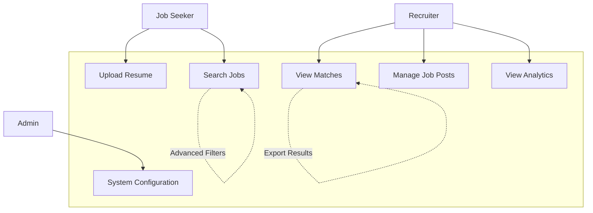
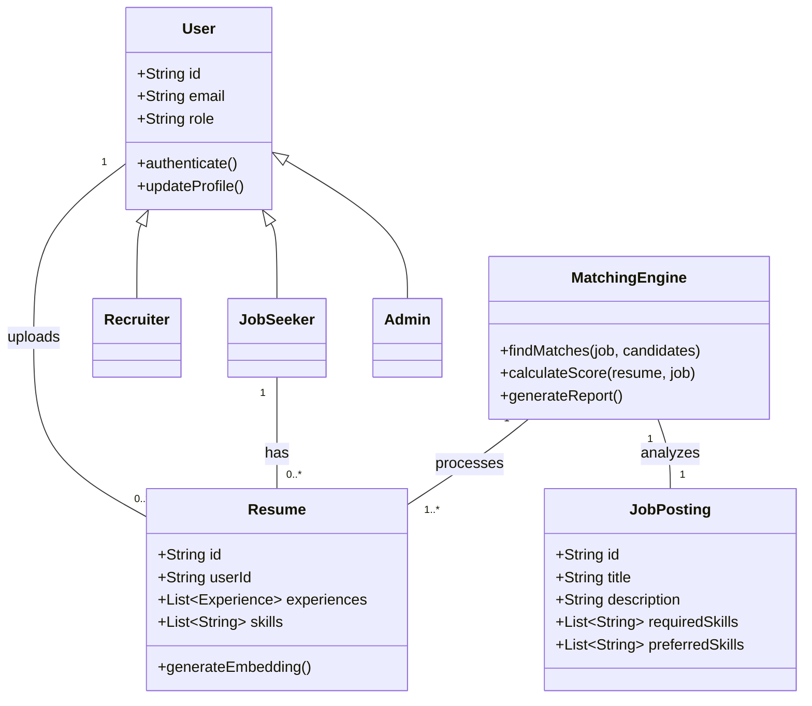
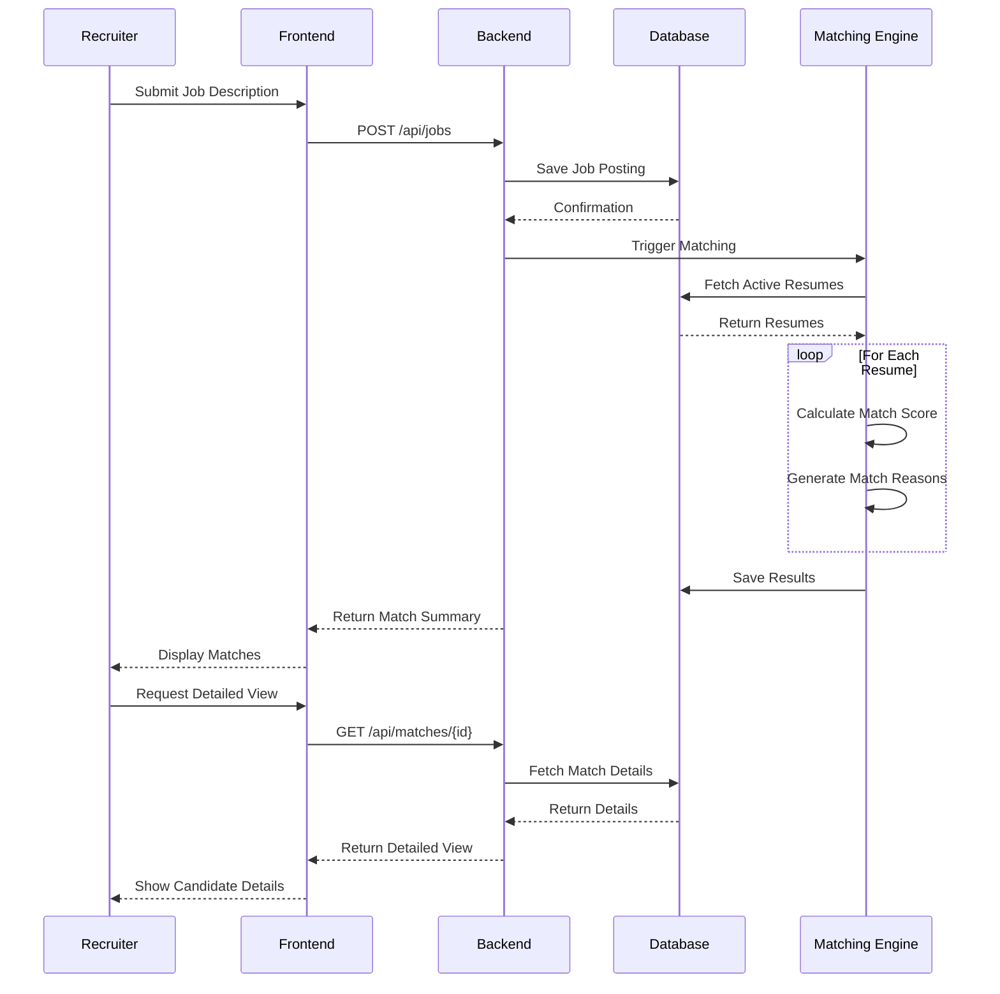
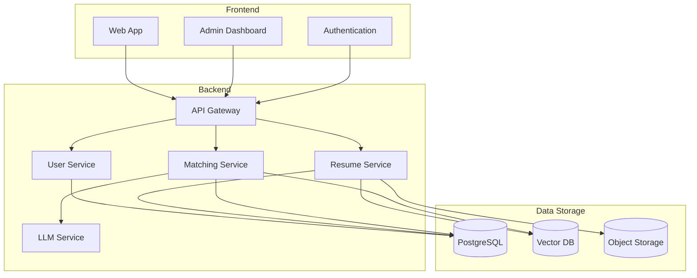
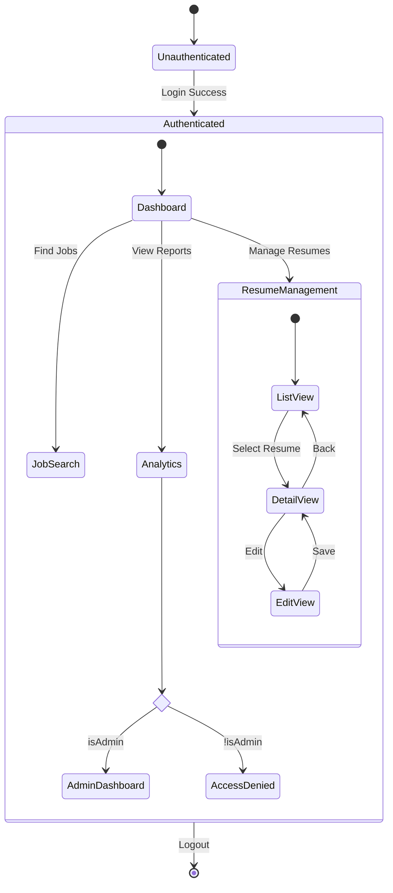

# CareerReco System Diagrams

## 1. Use Case Diagram

## 2. Class Diagram

## 3. Sequence Diagram: Resume Matching Process

## 4. Component Diagram

## 5. State Diagram: Application State

## Usage Notes

These diagrams use Mermaid.js syntax and can be rendered in:
- GitHub Markdown files
- VS Code with Mermaid extension
- Mermaid Live Editor (https://mermaid.live/)
- Any markdown viewer with Mermaid support

To update any diagram, simply modify the Mermaid code blocks above.
