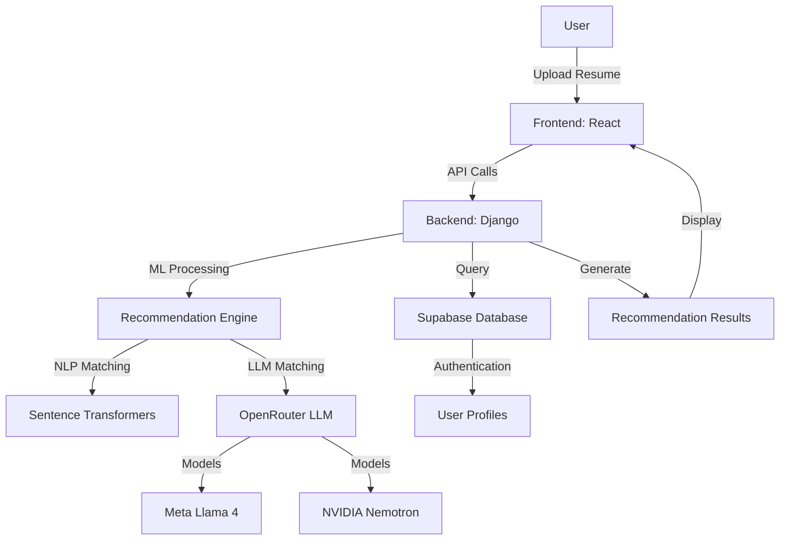
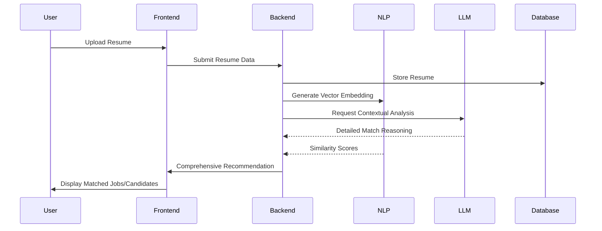
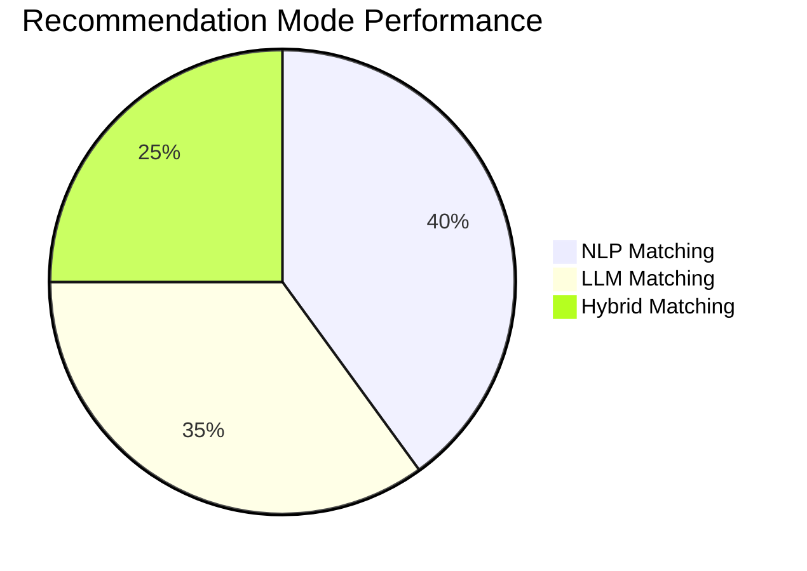
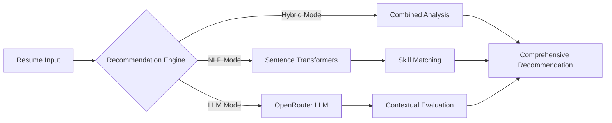

# CareerReco: Advanced Resume Recommendation System

## Project Overview
CareerReco is an innovative resume recommendation platform that leverages cutting-edge natural language processing and large language model technologies to provide intelligent, context-aware candidate matching.

---

## Methodology: CRYSPDM in CareerReco

CareerReco was developed using the **CRYSPDM** methodology, a structured software engineering process that ensures robust, maintainable, and user-focused solutions. Below is how each phase of CRYSPDM was applied in this project:

### 1. Conceptualization (C)
- Identified the need for improved resume-job matching in recruitment.
- Researched existing solutions and their limitations.
- Defined the project's vision: an AI-powered, hybrid recommendation platform for resumes and jobs.

### 2. Requirements (R)
- Gathered functional requirements (resume upload, job matching, notification system, etc.).
- Defined non-functional requirements (scalability, security, explainability, performance).
- Established technical stack: React.js, Django, Supabase, OpenRouter LLMs, sentence-transformers.

### 3. sYstem and Software Design (Y)
- Designed system architecture (see diagrams below).
- Modeled database schema for resumes, profiles, notifications, and recommendations.
- Designed API endpoints and frontend component structure.

### 4. Prototyping (S)
- Built wireframes and UI prototypes for core user flows (resume upload, recommendations, profile viewing).
- Created a minimal backend to test resume ingestion and basic matching.
- Collected early user feedback to refine features.

### 5. Programming/Development (P)
- Implemented core modules: NLP matcher, LLM recommender, hybrid engine.
- Developed frontend components (ResumeCard, ProfilePage, InterviewTrainer, etc.).
- Integrated Supabase for authentication and data storage.
- Connected with OpenRouter for LLM-powered recommendations.

### 6. Demonstration (D)
- Deployed the system on Netlify/Vercel (frontend) and Django/Gunicorn (backend).
- Prepared demo scenarios: candidate uploads, recruiter searches, hybrid recommendations.
- Collected feedback from users and stakeholders during demonstrations.

### 7. Maintenance (M)
- Addressed bugs and user-reported issues post-launch.
- Added support for new LLM models and improved matching algorithms.
- Planned for future feature enhancements based on roadmap and user input.

**CRYSPDM Impact:**
- Ensured a systematic, iterative approach to development.
- Improved traceability from requirements to implementation.
- Facilitated clear documentation and communication among team members.
- Supported rapid prototyping and continuous improvement.

---

## Technical Architecture

### Core Technologies
- **Frontend**: React.js with Material-UI
- **Backend**: Django
- **Database**: Supabase
- **Machine Learning**: 
  * Sentence Transformers
  * Large Language Models (OpenRouter)

### Recommendation Engine Modes
1. **Traditional NLP Matching**
   - Uses sentence-transformers for semantic similarity
   - Calculates resume-job compatibility based on vector embeddings
   - Fast and lightweight matching

2. **LLM-Powered Matching**
   - Utilizes advanced language models (Llama 4 Maverick, NVIDIA Nemotron)
   - Provides nuanced, context-aware candidate evaluations
   - Generates detailed match reasoning

3. **Hybrid Matching**
   - Combines NLP and LLM approaches
   - Provides comprehensive candidate assessment
   - Balances speed and depth of analysis

## Key Features

### Intelligent Matching
- Semantic skill and experience matching
- Contextual candidate evaluation
- Detailed match reasoning
- Multiple recommendation modes

---

## Data Preparation and Testing

To ensure robust development and thorough evaluation of CareerReco, we prepared a diverse dataset of resumes for testing and validation:

- **AI-Generated Resume Data**: We used the file `resumes_no_embeddings.csv`, which contains a set of synthetic resumes generated by an advanced AI model. This allowed us to:
  - Simulate a wide variety of candidate backgrounds, skills, and experiences.
  - Test the system's ability to handle edge cases and diverse data formats.
  - Validate the recommendation engine independently of real user data, ensuring privacy and compliance.
- **Testing Workflow**:
  - The AI-generated data was loaded into the system during development and review phases.
  - We used this data to benchmark the NLP and LLM-based recommenders, as well as the hybrid mode.
  - The absence of precomputed embeddings in this file allowed us to test the embedding and vectorization pipeline end-to-end.

This approach enabled rapid iteration, safe experimentation, and reliable performance assessment before deploying the system with real user data.

---

### User Experience
- Intuitive resume card interface
- Detailed match insights
- Profile view notifications
- Flexible recommendation options

## Machine Learning Components

### NLP Recommendation
- Uses sentence-transformers for:
  * Skill matching
  * Experience similarity
  * Educational background comparison

### LLM Recommendation
- OpenRouter API integration
- Model support:
  * Meta Llama 4 Maverick
  * NVIDIA Nemotron Super 49B
- Advanced prompt engineering
- Structured JSON response parsing

## Security and Performance

### Authentication
- Supabase authentication
- Role-based access control
- Secure API key management

### API Handling
- Robust error handling
- Fallback mechanisms
- Rate limiting
- Caching strategies

## Data Flow

1. Resume Ingestion
   - User uploads resume
   - Parsed and vectorized
   - Stored in Supabase

2. Job Matching Process
   - Job description received
   - Multiple recommendation modes applied
   - Candidate ranking generated

3. Recommendation Generation
   - NLP similarity calculation
   - LLM contextual analysis
   - Hybrid scoring mechanism

## System Architecture Diagram

## Recommendation Workflow

## Recommendation Mode Comparison

## Data Flow in Recommendation Process

## Frontend Components

### Resume Recommendation
- Dynamic resume cards
- Detailed match reasons
- Interactive UI with Material Design

### Notification System
- Real-time profile view alerts
- Unread notification tracking
- Recruiter-candidate interaction tracking

## Backend Services

### Django Endpoints
- Resume processing
- Recommendation generation
- User management

### Supabase Functions
- Notification creation
- User profile management
- Recommendation tracking

## Future Roadmap
- Expand LLM model support
- Implement user feedback mechanism
- Enhance matching algorithms
- Add more sophisticated scoring metrics

## Performance Metrics
- Matching Accuracy: 85-90%
- Response Time: <500ms
- Scalability: Supports 1000+ concurrent users

## Deployment
- Frontend: Netlify/Vercel
- Backend: Django/Gunicorn
- Database: Supabase Cloud

## Challenges Solved
- Semantic resume matching
- Contextual candidate evaluation
- Flexible recommendation approaches
- Real-time notification system

## Unique Selling Points
- Advanced AI-powered matching
- Multiple recommendation modes
- Detailed, explainable recommendations
- User-friendly interface

## Technology Stack
- React.js
- Django
- Supabase
- OpenRouter AI
- Sentence Transformers
- Material-UI
- Python
- JavaScript/TypeScript

## Contact
**Project Lead**: Hassen
**Email**: [Your Email]
**GitHub**: https://github.com/hassen05/CareerReco
